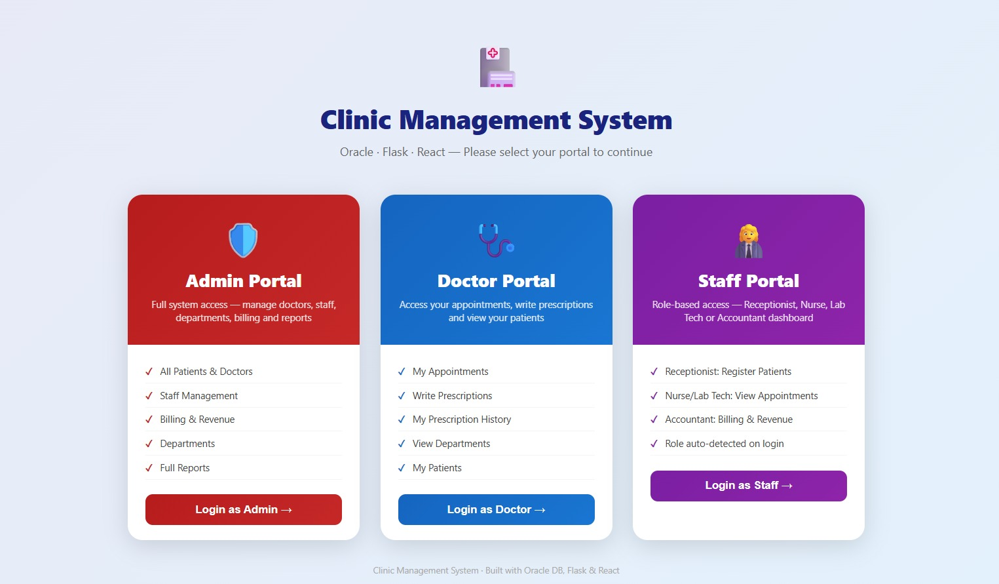
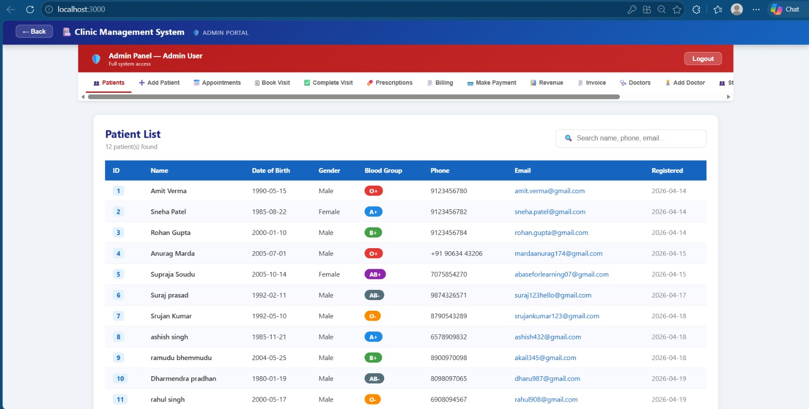
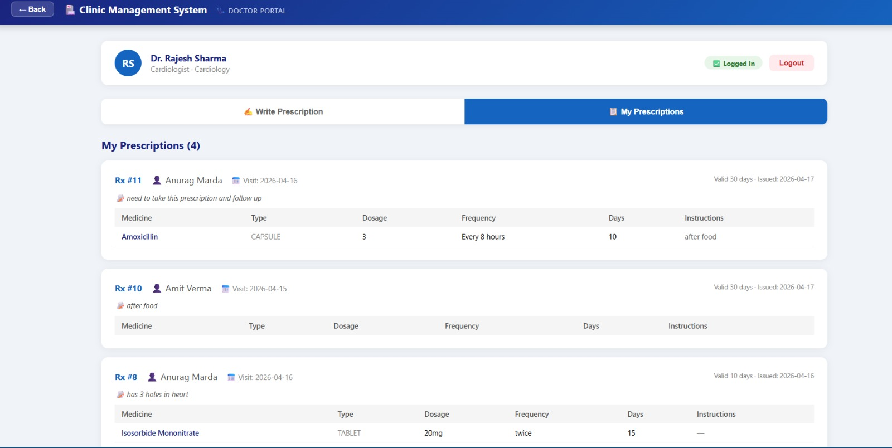

# 🏥 Clinic Management System

A full-stack clinic management application built with **Oracle XE 21c**, **Flask (Python)**, and **React.js**. The system provides three role-based portals — Admin, Doctor, and Staff — each with their own dashboard, access controls, and functionality.

---

## 📸 Interface of individual portals

### Landing Page — Portal Selection


### Admin Portal — Patient Management


### Doctor Portal — Prescription History


### Staff Portal — Receptionist Dashboard


---

## 🛠️ Tech Stack

| Layer    | Technology              |
|----------|-------------------------|
| Database | Oracle XE 21c           |
| Backend  | Python 3 · Flask        |
| Frontend | React.js · Recharts     |
| Driver   | python-oracledb          |
| CORS     | Flask-CORS              |

---

## 🏗️ System Architecture

```
React Frontend (port 3000)
        │
        │  HTTP / REST API
        ▼
Flask Backend (port 5000)
        │
        │  python-oracledb
        ▼
Oracle XE 21c (port 1539)
```

---

## 📁 Project Structure

```
clinic-management-system/
│
├── phase1/
│   └── normalisation_analysis(NF).docx  # proof of normalisation for all tables
│   └── relational schema and diagram           
│
├── phase2/
│   └── ddl/
│       ├── 00_create_user.sql  # Oracle user creation
│       ├── 01_sequences.sql    # Auto-increment sequences (15)
│       ├── 02_tables.sql       # All 15 tables with constraints
│       └── 03_triggers.sql     # 3 business logic triggers
│
├── phase3/
│   └── api/
│       ├── app.py              # Flask app entry point
│       ├── config.py           # Oracle DB connection config
│       ├── routes_patients.py      # Patient CRUD
│       ├── routes_doctors.py       # Doctor CRUD + login
│       ├── routes_appointments.py  # Appointment booking
│       ├── routes_prescriptions.py # Prescription management
│       ├── routes_billing.py       # Billing + payments + revenue
│       ├── routes_medical.py       # Medical records
│       ├── routes_staff.py         # Staff CRUD + login
│       └── routes_departments.py   # Department management
│
├── phase4/                     # React components
│   └── (complex queries, views, reports)
│
└── clinic-frontend/            # React application
    ├── src/
    │   ├── App.js
    │   ├── AdminPortal.js
    │   ├── DoctorPortal.js
    │   ├── StaffPortal.js
    │   └── components/
    │       ├── Patients.js
    │       ├── RegisterPatient.js
    │       ├── Appointments.js
    │       ├── BookAppointment.js
    │       ├── Billing.js
    │       └── ...
    └── package.json
```

---

## ✅ Prerequisites

Make sure these are installed before starting:

- **Oracle XE 21c** — [Download here](https://www.oracle.com/database/technologies/xe-downloads.html)
- **Python 3.8+** — `python3 --version`
- **Node.js 16+** — `node --version`
- **npm** — `npm --version`

---

## 🗄️ Database Setup (Phase 2)

Open a terminal and connect to Oracle as sysdba:

```bash
sqlplus / as sysdba
```

Run the setup scripts **in order**:

```sql
-- Step 1: Create the clinic user
@/path/to/phase2/ddl/00_create_user.sql

-- Step 2: Connect as the clinic user
CONNECT clinic_user/clinic123@localhost:1539/XEPDB1

-- Step 3: Create sequences
@/path/to/phase2/ddl/01_sequences.sql

-- Step 4: Create all 15 tables
@/path/to/phase2/ddl/02_tables.sql

-- Step 5: Create triggers
@/path/to/phase2/ddl/03_triggers.sql
```

Verify the setup:
```sql
SELECT table_name FROM user_tables ORDER BY table_name;
-- Should show 10 tables
```

---

## 🔧 Backend Setup (Phase 3 — Flask)

**Step 1 — Navigate to the API folder:**
```bash
cd phase3/api
```

**Step 2 — Install Python dependencies:**
```bash
pip install flask flask-cors oracledb
```

**Step 3 — Check your Oracle connection in `config.py`:**
```python
DB_CONFIG = {
    "user":     "clinic_user",
    "password": "clinic123",
    "dsn":      "localhost:1539/XEPDB1"
}
```
> If your Oracle listener runs on a different port, update `1539` accordingly.

**Step 4 — Start the Flask server:**
```bash
python3 app.py
```

You should see:
```
* Running on http://127.0.0.1:5000
```

**Step 5 — Verify the API is working:**
```bash
curl http://localhost:5000/api/health
# Expected: {"message": "Clinic API running", "status": "ok"}

curl http://localhost:5000/api/doctors/
# Expected: JSON list of doctors

curl http://localhost:5000/api/patients/
# Expected: JSON list of patients
```

---

## 🌐 Frontend Setup (React)

**Open a new terminal** (keep Flask running in the previous one):

**Step 1 — Navigate to the frontend folder:**
```bash
cd clinic-frontend
```

**Step 2 — Install dependencies:**
```bash
npm install
```

**Step 3 — Start the React app:**
```bash
npm start
```

Browser opens automatically at **http://localhost:3000**

---

## 🚀 Running the Full Project

You need **3 terminals open simultaneously**:

| Terminal | Command | Port |
|----------|---------|------|
| Terminal 1 | `sqlplus / as sysdba` (Oracle running) | 1539 |
| Terminal 2 | `cd phase3/api && python3 app.py` | 5000 |
| Terminal 3 | `cd clinic-frontend && npm start` | 3000 |

> **Important:** Always start Flask before React. React calls Flask, Flask calls Oracle.

---

## 🔒 Portals & Features

### 🔴 Admin Portal
Full system access — no login required in demo mode.

| Feature | Description |
|---------|-------------|
| Patient Management | View all patients, register new, search by name/phone/email |
| Doctor Management | Add doctors, toggle active/inactive, delete |
| Appointments | View all appointments with status badges |
| Book Visit | Book appointment for any patient with any doctor |
| Complete Visit | Record vitals and medical notes, auto-completes appointment |
| Prescriptions | View all prescriptions across the system |
| Billing | Create bills, view all invoices |
| Make Payment | Record CASH / CARD / UPI / INSURANCE / CHEQUE payments |
| Revenue Dashboard | Charts for paid vs pending, daily revenue trend (last 30 days) |
| Invoice | Full invoice per bill with medical record + prescription detail |
| Staff Management | Add/remove staff, toggle active status |
| Departments | Add/edit/delete departments with head doctor assignment |

---

### 🔵 Doctor Portal
Login with doctor credentials. Each doctor sees only their own data.

**Default doctor credentials (from seed data):**
| Username | Password | Doctor |
|----------|----------|--------|
| `rajesh_sharma` | `doc123` | Dr. Rajesh Sharma — Cardiology |
| `priya_mehta` | `doc123` | Dr. Priya Mehta — Neurology |
| `arjun_rao` | `doc123` | Dr. Arjun Rao — Orthopedics |

| Feature | Description |
|---------|-------------|
| My Appointments | View completed appointments assigned to this doctor |
| Write Prescription | Select patient → add medications with dosage, frequency, duration |
| My Prescriptions | Full prescription history with medication details |
| My Patients | List of patients who had appointments with this doctor |
| View Departments | See all clinic departments |

---

### 🟣 Staff Portal
Login with staff credentials. Role is **auto-detected** on login.

**Default staff credentials (from seed data):**
| Username | Password | Role | Department |
|----------|----------|------|------------|
| `kavita_nair` | `staff123` | Receptionist | Cardiology |
| `ramesh_kumar` | `staff123` | Nurse | Neurology |
| `anita_joshi` | `staff123` | Accountant | Admin |

| Role | Access |
|------|--------|
| **Receptionist** | Register new patients, book appointments, view patient list |
| **Nurse / Lab Tech** | View appointments, view patient list |
| **Accountant** | Billing dashboard, make payments, view revenue |

---

### Table List

#	Table	Primary Key	Key Foreign / Unique Constraints
1	PATIENT	patient_id	phone, email unique
2	DEPARTMENT	dept_id	dept_name unique; head_doctor_id → DOCTOR (deferrable)
3	DOCTOR	doctor_id	dept_id → DEPARTMENT; phone, email unique
4	STAFF	staff_id	dept_id → DEPARTMENT
5	APPOINTMENT	appt_id	patient_id → PATIENT, doctor_id → DOCTOR; UNIQUE(doctor_id, appt_date, time_slot) prevents double‑booking
6	PRESCRIPTION	rx_id	appt_id unique → APPOINTMENT (one‑to‑one)
7	MEDICATION	med_id	med_name unique
8	PRES_MEDICATION	(rx_id, med_id)	rx_id → PRESCRIPTION, med_id → MEDICATION
9	MEDICAL_RECORD	record_id	appt_id unique → APPOINTMENT (one‑to‑one)
10	BILLING	bill_id	appt_id unique → APPOINTMENT; amount > 0; payment_mode IN (…); payment_status IN (…)

### Key Design Decisions
1)Circular FK between DEPARTMENT.head_doctor_id and DOCTOR.dept_id → resolved by making the FK DEFERRABLE INITIALLY DEFERRED and inserting departments first with NULL head, then doctors, then updating the head.

2)One‑to‑one relationships (APPOINTMENT → PRESCRIPTION, MEDICAL_RECORD, BILLING) enforced by UNIQUE constraints on the foreign key columns.

3)Double‑booking prevention enforced at schema level by UNIQUE(doctor_id, appt_date, time_slot).

4)No repeating groups – medications linked via junction table PRES_MEDICATION.

5)Surrogate integer PKs for all tables except PRES_MEDICATION (composite natural PK).

### 📝 Significance of Each Phase
🔷 Phase 1: Database Design (ER Diagram, Schema, Normalization)
This foundational phase is about creating a blueprint for your data. Its significance lies in ensuring long-term data integrity and efficiency:

Eliminates Data Redundancy & Anomalies: Using Normalization (e.g., achieving 3NF) organizes data to minimize duplication, which saves storage and prevents update, insert, and delete anomalies.

Ensures Data Consistency: A well-defined ER Diagram and Relational Schema with clear primary/foreign keys act as a contract for developers and a guide for implementation, preventing structural errors later.

🔷 Phase 2: Oracle Implementation (DDL Scripts, Triggers)
This is where your database design is translated into a physical Oracle Database. Its significance is enforcing business rules at the data layer:

Enforces Critical Business Rules: Triggers, like your trg_prevent_double_booking, allow you to embed application logic (like checking for scheduling conflicts) directly into the database, ensuring rules are always enforced, regardless of how data is accessed.

Automates State Changes & Maintains Data Integrity: A trigger like trg_update_payment_status automatically updates related data (e.g., changing a bill's status from 'PENDING' to 'PARTIAL' or 'PAID'), ensuring consistency and reducing application-side errors.

🔷 Phase 3: Backend (Python Flask REST API)
This phase builds the bridge between your database and the user interface. Its significance is creating a secure, scalable, and controlled access point for data:

Acts as a Secure Middleman: The backend encapsulates the business logic and prevents direct client access to the database. All operations, like patient registration or appointment booking, go through your secure API.

Enables Loose Coupling & Reusability: A well-designed REST API creates a stable contract. This allows the frontend to be changed (e.g., to a mobile app) or updated without altering the underlying database logic, making the entire system more modular and maintainable.

🔷 Phase 4: Frontend (React.js)
This phase delivers the final user experience, transforming your API into an intuitive, interactive application. Its significance is providing a functional, user-friendly interface for clinic staff:

Creates an Interactive, Role-Based Dashboard: Using a framework like React allows you to build a dynamic Single Page Application (SPA). It efficiently fetches data from your API and updates the UI in real time for different user roles (Admin, Doctor, Staff).

Manages Complex Application State: React's component-based architecture and state management let you handle complex workflows (like booking an appointment with many input fields) in an organized way, ensuring a smooth user experience.

🏗️ How the Phases Build on Each Other
The four phases are not isolated; each one relies on the previous:

Phase 1 (Design) provides the blueprint for...

Phase 2 (Oracle Database) which is the structured repository of data, accessed by...

Phase 3 (Backend API), which secures and exposes this data through logical endpoints, which are finally consumed by...

Phase 4 (React Frontend), the final, interactive interface that users see and work with.

### Key Design Decisions

- **Circular FK** between `DEPARTMENT` (head_doctor_id) and `DOCTOR` (dept_id) — resolved using `ALTER TABLE` after both tables are created
- **One-to-one** relationships enforced via `UNIQUE` constraint on `appt_id` in `PATIENT_VITAL`, `MEDICAL_RECORD`, and `PRESCRIPTION`
- **15 Oracle sequences** for all primary keys (Oracle does not have AUTO_INCREMENT)
- **CLOB** columns for `symptoms`, `diagnosis`, `treatment_notes` — allows unlimited clinical text

### Triggers

| Trigger | Table | Action |
|---------|-------|--------|
| `trg_prevent_double_booking` | `APPOINTMENT` | Prevents same doctor being booked in same slot on same date |
| `trg_update_payment_status` | `BILLING` | Automatically updates payment_status to PAID when a payment is recorded (or PARTIAL if partial payments were supported – simplified to PAID on any non‑null payment) |
| `trg_complete_appointment` | `MEDICAL_RECORD` | Auto-marks appointment as `COMPLETED` when a medical record is inserted |

---

## 🌐 API Reference

Base URL: `http://localhost:5000`

### Patients
| Method | Endpoint | Description |
|--------|----------|-------------|
| GET | `/api/patients/` | Get all patients |
| GET | `/api/patients/<id>` | Get single patient |
| POST | `/api/patients/` | Register new patient |
| PUT | `/api/patients/<id>` | Update patient |

### Doctors
| Method | Endpoint | Description |
|--------|----------|-------------|
| GET | `/api/doctors/` | Get all doctors |
| POST | `/api/doctors/login` | Doctor login |
| POST | `/api/doctors/add` | Add new doctor |
| PUT | `/api/doctors/<id>/toggle` | Toggle active/inactive |
| GET | `/api/doctors/<id>/my-appointments` | Doctor's completed appointments |
| GET | `/api/doctors/<id>/my-prescriptions` | Doctor's prescription history |
| DELETE | `/api/doctors/<id>` | Delete doctor (with safety check) |

### Appointments
| Method | Endpoint | Description |
|--------|----------|-------------|
| GET | `/api/appointments/` | Get all appointments |
| POST | `/api/appointments/` | Book appointment |
| PUT | `/api/appointments/<id>/status` | Update status |
| GET | `/api/appointments/doctor/<id>` | Get by doctor |

### Billing
| Method | Endpoint | Description |
|--------|----------|-------------|
| GET | `/api/billing/report` | Full billing report |
| POST | `/api/billing/` | Create bill |
| GET | `/api/billing/summary` | Payment status summary |
| POST | `/api/billing/pay` | Record payment |
| GET | `/api/billing/pending` | Pending/partial bills |
| GET | `/api/billing/revenue` | Revenue totals |
| GET | `/api/billing/invoice/<id>` | Full invoice with medical + prescriptions |
| GET | `/api/billing/daily-revenue` | Daily revenue (last 30 days) |

### Prescriptions
| Method | Endpoint | Description |
|--------|----------|-------------|
| GET | `/api/prescriptions/medications` | All medications |
| GET | `/api/prescriptions/<appt_id>` | Get prescription by appointment |
| POST | `/api/prescriptions/` | Create prescription with items |

### Staff
| Method | Endpoint | Description |
|--------|----------|-------------|
| GET | `/api/staff/` | Get all staff |
| POST | `/api/staff/login` | Staff login (returns role) |
| POST | `/api/staff/add` | Add staff member |
| PUT | `/api/staff/<id>/toggle` | Toggle active/inactive |
| DELETE | `/api/staff/<id>` | Delete staff |

### Departments
| Method | Endpoint | Description |
|--------|----------|-------------|
| GET | `/api/departments/` | Get all with head doctor + staff count |
| POST | `/api/departments/add` | Add department |
| PUT | `/api/departments/<id>` | Update department |
| DELETE | `/api/departments/<id>` | Delete (with doctor/staff safety check) |

---

## ⚠️ Troubleshooting

**Oracle listener not running:**
```bash
lsnrctl start
lsnrctl status   # Should show "Service xepdb1 READY"
```

**Oracle DB not registered with listener:**
```sql
-- In SQLPlus as sysdba:
ALTER SYSTEM REGISTER;
EXIT
```

**Flask can't connect to Oracle (DPY-6005 error):**
- Make sure Oracle listener is running before starting Flask
- Confirm `config.py` has the right port (default Oracle XE uses `1521`, this project uses `1539`)
- Test connection: `sqlplus clinic_user/clinic123@localhost:1539/XEPDB1`

**React shows blank page / network error:**
- Make sure Flask is running on port 5000 before starting React
- Check browser console for CORS errors

---

## 👨‍💻 Author

- **Anurag Marda** — BT23CSE032, VNIT Nagpur

---

## 🏫 Institution

Visvesvaraya National Institute of Technology (VNIT), Nagpur
B.Tech — Computer Science and Engineering, 2027
